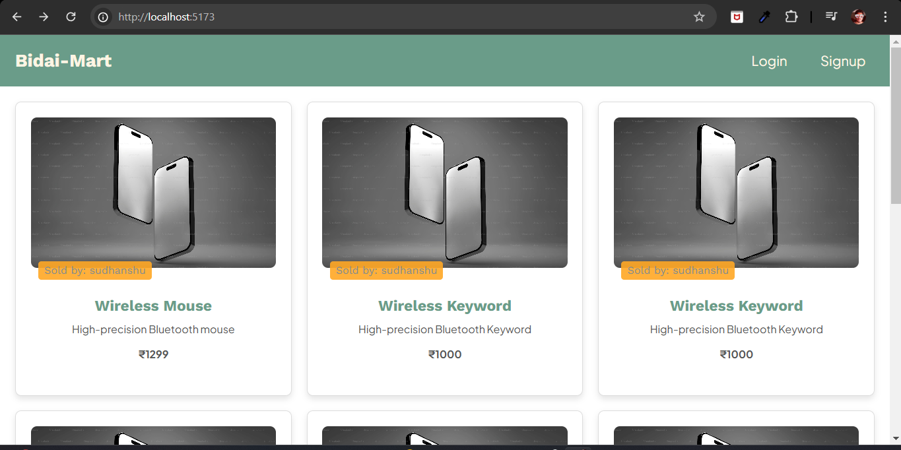

## **📌 BID.ai - Marketplace for Digital Products**



BID.ai is a **digital product marketplace** where users can list, buy, and sell digital products with a **view-based model**. Admins can track top sellers and best-performing listings.

---

## **🚀 Features**

- **User Dashboard**: Add products, track views, and share referral links.
- **Admin Dashboard**: Monitor total listings, top sellers, and high-performing products.
- **View-Based Model**: Products have limited views, encouraging strategic purchases.
- **Secure Authentication**: JWT-based authentication for users and admins.

---

## **🛠 Tech Stack**

- **Frontend**: React, TypeScript, Vite, Context API
- **Backend**: Node.js, Express.js, MongoDB
- **Authentication**: JWT-based authentication
- **Styling**: Pure CSS

---

## **⚡ Setup Instructions**

### **1️⃣ Clone the Repository**

```bash
git clone https://github.com/YOUR_GITHUB_USERNAME/YOUR_REPOSITORY_NAME.git
cd YOUR_REPOSITORY_NAME
```

### **2️⃣ Install Dependencies**

#### **Backend**

```bash
cd backend
npm install
```

#### **Frontend**

```bash
cd frontend
npm install
```

### **3️⃣ Environment Variables**

Create a `.env` file in both `backend` and `frontend` with necessary variables:

#### **Backend (`/backend/.env`)**

```
PORT=5000
MONGO_URI=your_mongodb_connection_string
JWT_SECRET=your_jwt_secret
```

#### **Frontend (`/frontend/.env`)**

```
VITE_API_BASE_URL=http://localhost:5000/api
```

### **4️⃣ Run the Application**

#### **Backend**

```bash
cd backend
npm run dev
```

#### **Frontend**

```bash
cd frontend
npm run dev
```

---

## **🌟 Contributing**

Feel free to fork and contribute! Open a PR with your improvements. 🚀

---

## **📄 License**

This project is **MIT Licensed**.

---

### 🔗 **Live Demo**: [Your Website URL Here]

Let me know if you need any modifications! 😊🚀
